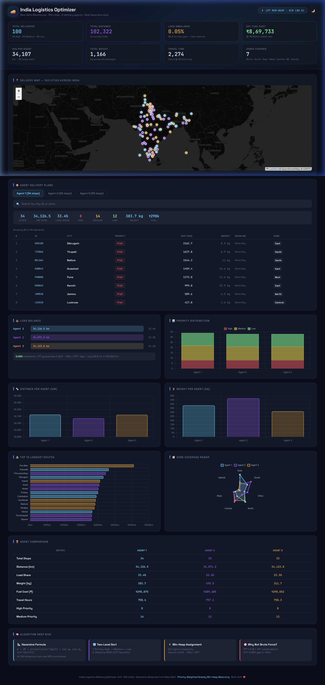

<div align="center">

<br>


<br><br>

# 🚚 India Logistics Delivery Optimizer

An intelligent delivery route optimization system that distributes **100 real Indian city** deliveries across multiple agents using a **Priority-Weighted LPT Min-Heap** algorithm.

Achieves **0.05% load imbalance** — a 55.3 km gap over 102,322 km — optimized in under **4 milliseconds**.

<br>



<br>

</div>

---

## 📌 Highlights

<table>
<tr>
<td width="50%">

### 🧠 Smart Optimization
- Priority-aware delivery assignment
- LPT (Largest Processing Time) heuristic
- Min-Heap for O(n log k) complexity
- Near-optimal load balancing across agents

</td>
<td width="50%">

### 📊 Rich Analytics Dashboard
- Interactive Leaflet.js map with 100 city markers
- 5 Chart.js visualizations with live data
- Dark & Light theme with smooth transitions
- Agent-level drill-down with search & filter

</td>
</tr>
<tr>
<td width="50%">

### 🗺️ Real-World Data
- 100 actual Indian cities with GPS coordinates
- Haversine distance calculations from New Delhi
- 7 geographic zones coverage
- Real package weights & delivery deadlines

</td>
<td width="50%">

### ⚡ Production Ready
- Zero external Python dependencies
- Comprehensive error handling & validation
- Configurable agent count via CLI
- Unit tested with `unittest`

</td>
</tr>
</table>

---

## 🚀 Getting Started

### Prerequisites

- Python 3.8 or higher
- A modern web browser (Chrome, Firefox, Edge)

### Installation

```bash
# Clone the repository
git clone https://github.com/umangjzx/Logistics-and-Optimization-.git
cd Logistics-and-Optimization-
```

### Usage

```bash
# Run the optimizer with default settings
python delivery_optimizer.py

# Run with custom configuration
python delivery_optimizer.py --input my_data.csv --agents 5 --out-csv result.csv

# Launch the interactive dashboard
python -m http.server 8000
# Open → http://localhost:8000/dashboard.html

# Run the test suite
python -m unittest test_delivery_optimizer.py
```

<details>
<summary><b>📋 All CLI Options</b></summary>
<br>

| Flag | Default | Description |
|------|---------|-------------|
| `-i`, `--input` | `india_deliveries.csv` | Path to input CSV file |
| `-c`, `--out-csv` | `delivery_plan.csv` | Path to output CSV file |
| `-j`, `--out-json` | `delivery_plan.json` | Path to output JSON file |
| `-a`, `--agents` | `3` | Number of delivery agents |

</details>

---

## 🧠 How It Works

The system solves a variant of the **NP-hard multiprocessor scheduling problem** using a two-phase greedy approach:

### Phase 1 — Intelligent Sorting

Deliveries are sorted using a **two-level key**:

| Level | Key | Strategy |
|-------|-----|----------|
| 1st | Priority Rank | High (1) → Medium (2) → Low (3) |
| 2nd | Distance | Descending — **Largest Processing Time** heuristic |

### Phase 2 — Min-Heap Assignment

A min-heap maintains agent workloads. Each delivery is assigned to the **least-loaded agent**, ensuring near-optimal distribution.

> **Approximation Guarantee:** ≤ (4/3 − 1/3k) × OPT

<details>
<summary><b>📈 Optimization Results</b></summary>
<br>

| Agent | Stops | Distance (km) | Load Share |
|-------|-------|---------------|------------|
| Agent 1 | 34 | 34,126.5 | 33.4% |
| Agent 2 | 33 | 34,071.2 | 33.3% |
| Agent 3 | 33 | 34,123.8 | 33.3% |
| **Total** | **100** | **102,321.5** | **100%** |

**Max gap:** 55.3 km (0.05% imbalance)

For comparison — brute force would require evaluating `3¹⁰⁰ ≈ 5×10⁴⁷` combinations. This algorithm achieves near-optimal results in **< 4 ms**.

</details>

---

## 🗺️ Dataset

**100 cities** across **7 geographic zones** with real GPS coordinates. All distances computed via the **Haversine formula** from the New Delhi warehouse (28.61°N, 77.21°E).

<details>
<summary><b>🌍 Zone Distribution</b></summary>
<br>

| Zone | Cities | Examples |
|------|--------|----------|
| 🔵 North | 18 | Delhi, Jaipur, Chandigarh, Shimla, Srinagar |
| 🟢 South | 21 | Chennai, Bangalore, Kochi, Madurai, Coimbatore |
| 🟡 East | 19 | Kolkata, Guwahati, Bhubaneswar, Ranchi, Siliguri |
| 🟠 West | 11 | Mumbai, Ahmedabad, Pune, Surat, Rajkot |
| 🟣 Central | 19 | Nagpur, Bhopal, Indore, Lucknow, Kanpur |
| 🔴 Northeast | 4 | Shillong, Imphal, Aizawl, Silchar |
| ⚪ Islands | 1 | Port Blair (Andaman & Nicobar) |

</details>

---

## 📊 Dashboard Features

| Feature | Technology | Description |
|---------|------------|-------------|
| 🗺️ Interactive Map | Leaflet.js + CartoDB | 100 city markers with click popups, agent-colored dots |
| 📈 KPI Cards | Vanilla JS | 8 animated counters with live formatting |
| 📊 Priority Chart | Chart.js | Stacked bar — High/Medium/Low per agent |
| 📏 Comparison Charts | Chart.js | Distance and weight per agent |
| 🏔️ Top Routes | Chart.js | Horizontal bar of 15 longest delivery routes |
| 🧭 Zone Radar | Chart.js | Radar chart of geographic coverage |
| 🔍 Agent Tables | Vanilla JS | Tabbed tables with live search & filter |
| 🌗 Theme Toggle | CSS Variables | Dark ↔ Light with theme-aware map tiles |

---

## 📁 Project Structure

```
📦 Logistics-and-Optimization
├── 🐍 delivery_optimizer.py       Core engine — parse, sort, assign, output
├── 📊 india_deliveries.csv        100-city input dataset with GPS coordinates
├── 🌐 dashboard.html              Interactive analytics dashboard
├── 📦 dashboard_data.js           Pre-computed data module for dashboard
├── 🧪 test_delivery_optimizer.py  Unit tests for core algorithms
├── 📋 delivery_plan.csv           Generated agent assignments
├── 📋 delivery_plan.json          Generated full analytics payload
├── 📁 assets/                     Screenshots and media
└── 📖 README.md                   You are here
```

---

## 🔑 Key Metrics

<div align="center">

| Metric | Value |
|:------:|:-----:|
| **Total Distance** | 102,321.5 km |
| **Load Imbalance** | 0.05% (55.3 km) |
| **Total Weight** | 1,165.9 kg |
| **Est. Fuel Cost** | ₹8,69,733 |
| **Est. Travel Time** | 2,273.8 hours |
| **Optimization Time** | < 4 ms |
| **Zero Dependencies** | ✅ |

</div>

---

## 🛠️ Built With

<div align="center">

| | Technology | Purpose |
|:-:|-----------|---------|
| 🐍 | **Python 3.8+** | Core optimizer (stdlib only) |
| 🗺️ | **Leaflet.js 1.9** | Interactive mapping |
| 📊 | **Chart.js 4.4** | Data visualizations |
| 🎨 | **CSS Variables** | Theming & responsive design |
| ✏️ | **Space Grotesk** | Primary typography |
| 🔤 | **JetBrains Mono** | Monospace / data display |

</div>

---

## 📝 License

This project is licensed under the **MIT License** — see the [LICENSE](LICENSE) file for details.

---

<div align="center">

**Made with ❤️ by [Umang Jaiswal](https://github.com/umangjzx)**

*Built for the CIT Logistics Optimization Task*

</div>
